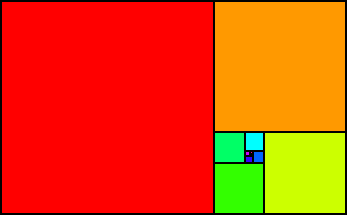
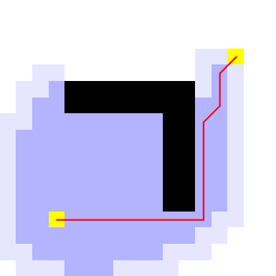
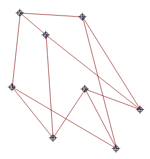
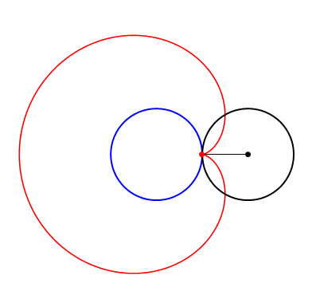
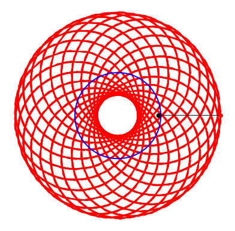

# Mathematica Class Demonstrations

A large collection of Mathematica demonstrations written by Adam Rumpf, sorted according to the class that they are most likely to be useful for.

## Table of Contents

* [Overview](#overview)
* [Calculus, Differential Equations, and Analysis](#calculus-differential-equations-and-analysis)
  * [Complex Newton's Method](#complex-newtons-method)
  * [Complex Operations](#complex-operations)
  * [Crowd Escape Panic Model](#crowd-escape-panic-model)
  * [Karush-Kuhn-Tucker (KKT) Conditions](#karush-kuhn-tucker-kkt-conditions)
  * [Monte Carlo Method](#monte-carlo-method)
  * [Taylor and Fourier Series Approximations](#taylor-and-fourier-series-approximations)
  * [Vector Kinematics](#vector-kinematics)
* [Number Theory](#number-theory)
  * [Continued Fraction Square Packing](#continued-fraction-square-packing)
  * [Pascal's Triangle Fractals](#pascals-triangle-fractals)
  * [Recamán's Sequence](#recamáns-sequence)
  * [Remainder Graphs](#remainder-graphs)
* [Graph Theory](#graph-theory)
  * [Dijkstra's Algorithm and A* Search](#dijkstras-algorithm-and-a-search)
  * [Graph Untangler](#graph-untangler)
* [Voting Theory](#voting-theory)
  * [Comparison of Single-Winner Voting Systems](#comparison-of-single-winner-voting-systems)
  * [Duverger's Law](#duvergers-law)
  * [Winner-Take-All Distortion](#winner-take-all-distortion)
* [Geometry](#geometry)
  * [Triangle Centers](#triangle-centers)
* [Just for Fun](#just-for-fun)
  * [Bézier Curves](#bézier-curves)
  * [Domino and Tromino Tiling](#domino-and-tromino-tiling)
  * [Dragon Curve](#dragon-curve)
  * [Fractal Shoulder Angels and Devils](#fractal-shoulder-angels-and-devils)
  * [Pythagoras Tree](#pythagoras-tree)
  * [Spirograph](#spirograph)

## Overview

This repository contains a large collection of Mathematica notebook files written during my time as a graduate student at Illinois Institute of Technology between 2014 and 2019, although I intend to add more over time. I originally started these projects as a way to teach myself Mathematica for use as a calculus teaching assistant, but eventually started making demonstrations for topics of personal interest or for use in my own classes.

Some of these projects have been uploaded to the [_Wolfram Demonstrations Project_](http://demonstrations.wolfram.com/). My creator page can be found at http://demonstrations.wolfram.com/author.html?author=Adam+Rumpf.

Most of these files are meant to be used by evaluating the entire notebook and then interacting with the resulting Manipulate environments or other functions. All of the individual notebook files are completely standalone and meant to be downloaded à la carte depending on your interests.

In order to download just a single file, navigate to its section below and click on the **Notebook** link. The `.nb` file can then be downloaded by right clicking the **Raw** link. Alternatively, you can find the file in the directories in this repository.

## Calculus, Differential Equations, and Analysis

Many of the files in this folder are things that I wrote to show my calculus students, either demonstrating material from class or demonstrating material from later classes that indirectly involve the concepts from basic calculus. This includes a variety of material related to fractals, dynamical systems, computational mathematics, and complex analysis.

### Complex Newton's Method

 

Created 2/23/2016

[Notebook Link](../master/calc-diffeq-analysis/complex-newtons-method.nb)

This is a demonstration of how [Newton's Method](https://en.wikipedia.org/wiki/Newton%27s_method) works for complex-valued functions. Most Calculus students will learn about Newton's Method for finding roots of real-valued functions, and may be surprised to learn that it also works for complex numbers. They may also learn that the method does not necessarily always converge to the root nearest the initial guess due to "overshooting" in unexpected ways. For real numbers this phenomenon is not very interesting to look at, but for the complex numbers we can generate fascinating and beautiful fractal basins of attraction.

The main function of this demonstration allows the user to specify a function and a few other parameters, and outputs a coloring of a portion of the complex plane demonstrating the basins of attraction of the different roots. Note that this may take a while to calculate for some large cases with many nodes. For this reason I would not recommend running the entire notebook, but rather running the initialization code and then evaluating one function at a time.

### Complex Operations

 

Created 3/20/2017

[Notebook Link](../master/calc-diffeq-analysis/complex-operations.nb)

This is a lightweight visual demonstration of how familiar mathematical operations (addition, multiplication, trigonometric functions, etc.) affect the complex numbers, displayed as vectors in the complex plane. The user can select an operation or function and then click and drag the input vector or vectors to see how this affects the output vector. In particular, it is interesting to look at how changing just the magnitude or just the angle of an input vector affects the output.

### Crowd Escape Panic Model

 

Created 5/1/2018

[Notebook Link](../master/calc-diffeq-analysis/crowd-escape-panic.nb)

This is an interactive version of a model described in the following 2000 [article](https://www.nature.com/articles/35035023):

> D. Helbing, I. Farkas, and T. Vicsek. Simulating dynamical features of escape panic. _Nature_, 407:487-490, 2000.

The article describes a dynamical systems model for crowds of people attempting to run to a building exit during a panic. The model is similar to those used in fluid dynamics. Each person is treated as a particle with a certain radius. Each particle attempts to move toward the exit, but they also repel each other if they get too close (incredibly strongly if they are within crush distance of each other). For each particle we can define a total force function that includes its own desired movement, repulsion from other particles and obstacles, body forces from intersecting particles and obstacles, and sliding friction past particles and obstacles. The total force can then be used to define the particle's acceleration vector, which in turn defines a system of ordinary differential equations to determine each particle's position as a function of time.

This demonstration implements the model and displays an animation of the crowd as it tries to reach the exit. Controls allow the user to change the layout of the room, including obstacles and the size of the exit. Particles are colored according to the amount of crush force experienced from the surrounding particles, becoming more red as the force increases. A plot is also displayed in the corner of the animation, with the green line indicating the number of successful exits and the red line indicating the total crush force.

### Karush-Kuhn-Tucker (KKT) Conditions

 

Created 5/7/2018

[Notebook Link](../master/calc-diffeq-analysis/kkt-conditions.nb)

[Demonstration Link](http://demonstrations.wolfram.com/KarushKuhnTuckerKKTConditionsForNonlinearProgrammingWithIneq/)

This is a graphical demonstration of the [KKT conditions](https://en.wikipedia.org/wiki/Karush%E2%80%93Kuhn%E2%80%93Tucker_conditions) applied to a constrained nonlinear optimization problem. The KKT conditions generalize the method of [Lagrange multipliers](https://en.wikipedia.org/wiki/Lagrange_multipliers) to allow for inequality constraints as well as equality constraints. They provide a set of algebraic conditions involving the objective function, the constraint functions, and their derivatives, which give necessary (and under the right circumstances sufficient) conditions for optimality. This provides us with a solution method for the optimization problem, since we can simply solve the system of equations defined by the KKT conditions.

There are four parts to the KKT conditions: _stationarity_, _primal feasibility_, _dual feasibility_, and _complementary slackness_. _Stationarity_ ensures local optimality, and essentially means that the objective function should "flatten out" at the optimal solution (specifically, this requires that the gradient of the objective function be either zero or collinear with the gradients of the constraint functions). _Primal feasibility_ is obvious, and just means that the given constraints must be satisfied. Stationarity and primal feasibility are both present in the method of Lagrange multipliers, while dual feasibility and complementary slackness are unique to the KKT conditions, and are there to deal with the possibility of the optimal solution lying strictly inside of the feasible set rather than on its boundary. Specifically, _dual feasibility_ ensures that an optimal solution lie on the correct side of the boundary, while _complementary slackness_ ensures that an interior optimal solution has a stationary objective.

This demonstration shows a 2D constrained optimization problem with a single inequality constraint. In the top left window, the contour lines of the objective are shown in gray, the feasible set (with its contour lines) is shaded blue, and the optimal solution is shown as a red dot. The user can click and drag to select a solution, and the KKT conditions for that solution will be shown in the other windows. Try moving the selected point around and watching how the conditions change in response.

### Monte Carlo Method

 

Created 9/13/2016

[Notebook Link](../master/calc-diffeq-analysis/monte-carlo-method.nb)

[Monte Carlo methods](https://en.wikipedia.org/wiki/Monte_Carlo_method) are a type of computational method for numerical integration based on random experiments. If the goal is to calculate the area within a particular curve, then a Monte Carlo method consists of randomly sampling points within a region of known area that surrounds the region of interest. In expectation, the ratio of points within the region of interest to points outside of the region of interest should equal the ratio of the two regions' areas, and because the surrounding region's area is known, this ratio can be used to calculate the unknown region's area. Due to the random nature of the experiment the ratio will not be exact, and may vary between realizations, but as the number of sample points increases the ratio should converge to the correct value.

This Notebook includes a visual demonstration of the Monte Carlo method applied to calculating two separate areas: the area under an arbitrary curve, and the area of a unit circle (which should be exactly π, making this method a way to numerically approximate π). For each experiment, the user can select how many points to randomly sample. Running and re-running the command should produce slightly different results due to the randomness. There are also functions to plot the approximation error as the number of sample points increases, to show how it generally decreases as the number of iterations increases.

### Taylor and Fourier Series Approximations

 

Created 11/6/2017

[Notebook Link](../master/calc-diffeq-analysis/taylor-fourier-series.nb)

This demonstration shows how a [Taylor Series](https://en.wikipedia.org/wiki/Taylor_series) or a [Fourier Series](https://en.wikipedia.org/wiki/Fourier_series) approximation of a given function changes as more terms are added to the series. The Taylor and Fourier series' are both ways of representing functions as linear combinations of simpler functions (polynomial functions for Taylor and trigonometric functions for Fourier). They also have important applications in computational mathematics, since taking only the first few terms of the series can provide a simple approximation of a potentially complicated function within a small neighorhood.

This program includes two Manipulate environments: one for Taylor series and one for Fourier series. Both include a dropdown menu of example functions and a slider to select the number of terms to include. The Taylor series also includes a slider to select the center of the approximation. These can be used to show how well the approximations model the original function near or far from the center, and how adding more terms changes things.

### Vector Kinematics

 

Created 8/28/2017

[Notebook Link](../master/calc-diffeq-analysis/vector-kinematics.nb)

This demonstration is meant for elementary Calculus students encountering the concept of position, velocity, and acceleration vectors for the first time. It includes a series of Manipulate environments which describe various kinematic systems such as ballistic motion and rotational orbiting. Within each system there is a time slider to animate the system, and there is a toggle to select whether to display the position vector (with its x- and y-components), the velocity vector (with its x- and y-components), the acceleration vector (with its x- and y-components), and the velocity vector along with the acceleration vector. The purpose of these animations is to give a visual demonstration of how the velocity vector describes where the position vector is "about" to move to, and how the acceleration vector does the same for the velocity vector.

## Number Theory

Number theory is not really my area, so most of the files in this folder are related to number sequences which give rise to interesting graphics that anybody can appreciate.

### Continued Fraction Square Packing

 

Created 5/23/2018

[Notebook Link](../master/number-theory/continued-fraction-square-packing.nb)

This is a program for constructing geometric pictures of [continued fractions](https://en.wikipedia.org/wiki/Continued_fraction). A continued fraction is a way to represent a real number as a sequence of integers, similar to how a decimal expansion is a way to represent a real number as a sequence of integers. The way to interpret a decimal expansion like "3.14159" is to recognize that each digit tells us the coefficient in a series of decreasing powers of 10, so the leading 3 should be multiplied by 1, then the 1 should be multiplied by 1/10, then the 4 should be multiplied by 1/100, and so on, and all of these values should be added together. Some numbers (like 2 and 564 and 5/8) can be represented exactly with finitely many decimal values, while others (like π and e and √2) cannot, but they can at least be approximated by specifying the first few terms and truncating the rest.

The continued fraction representation of a number comes from iteratively taking its integer part and inverting its fractional part. Taking π as an example, the integer part is 3 and the fractional part is 0.14159..., so the first digit in our continued fraction representation is 3. Then we invert the fractional part to get 1/0.14159 = 7.06251.... That has an integer part of 7, so our second digit is 7. The fractional part can be inverted to get 1/0.06251... = 15.99659..., and so the next digit is 15. Going through the same process again will yield 1 and then 292 as the next two digits. Much like with the decimal representation, since π is irrational this process will never end, so we must choose to truncate it at some point. If we chose to do that here, then our continued fraction approximation of π would be expressed as [3; 7, 15, 1, 292], the sequence of digits that we just found. The way to interpret a continued fraction representation is to plug the digits into a sequence of nested fractions of the form 3+1/(7+1/(15+1/(1+1/292))).

There is a geometric interpretation of this process, and that is what this program generates. Imagine that we draw a rectangle with height 1 and width π, and that we attempt to draw as many unit squares as we can inside this box. If we start at the lefthand side and continue to the right, we can fit exactly 3 squares before running out of room, and the remaining 1 by 0.14159... space will be empty. Now suppoose that we wish to fit as many squares of side length 0.14159... as possible into this empty space. We can rescale by multiplying everything by 1/0.14159... (which is 7.06251...), in which case the problem becomes trying to fit as many unit squares as possible into a 1 by 7.06251... unit space. The solution is obviously 7, with a remaining 1 by 0.06251... space. This process of iteratively packing squares and rescaling the gap is analogous to the above process of taking the unit part and inverting the fractional part, and it will produce the same sequence of integers.

This box packing process is very much like the process for generating a [golden spiral](https://en.wikipedia.org/wiki/Golden_spiral), and in fact if we begin with rectangle whose dimensions are 1 by φ (the [golden ratio](https://en.wikipedia.org/wiki/Golden_ratio)) box the two processes are exactly the same. Because the golden spiral involves packing a single square in each iteration, this implies that the continued fraction representation of φ is [1; 1, 1, 1, 1, ...], which is indeed true. It is for this reason that φ is occasionally referred to as the ["most irrational"](http://www.ams.org/publicoutreach/feature-column/fcarc-irrational4) number. Because all of the digits in the continued fraction representation are inverted, large digits indicates that the term contributes a small value to the overall sum, and so truncating a large digit leads to smaller truncation error than truncating a small digit. Because all digits of φ's continued fraction are the smallest possible positive integer, truncating its continued fraction leads to the largest possible truncation error, making it the number with the worst possible rational approximations.

### Pascal's Triangle Fractals

 

Created 6/28/2015

[Notebook Link](../master/number-theory/pascals-triangle-fractals.nb)

[Pascal's Triangle](https://en.wikipedia.org/wiki/Pascal%27s_triangle) is a triangular array best known for the property that its rows consist of the [binomial coefficients](https://en.wikipedia.org/wiki/Binomial_coefficient). There are many other lesser-known properties of Pascal's triangle, including its relationship to the fractal [Sierpiński Triangle](https://en.wikipedia.org/wiki/Sierpi%C5%84ski_triangle). This is one of my favorite examples of a fractal appearing in an unexpected place.

A Sierpiński triangle can be generted by highlighting all odd entries in Pascal's triangle. Using the fact that each entry of Pascal's triangle is the sum of the two preceding entries, we can think of Pascal's triangle as an [elementary cellular automaton](https://en.wikipedia.org/wiki/Elementary_cellular_automaton) (specifically [Rule 60](https://en.wikipedia.org/wiki/Elementary_cellular_automaton#Rule_60)).

This program generates an instance of Pascal's triangle with the specified number of rows, and can color the entries depending on whether they are divisible by a chosen value. Highlighting the entries not divisible by 2 (i.e. the odd entries) generates a Sierpiński triangle. Choosing values other than 2 results in different fractals.

### Recamán's Sequence

 

Created 8/25/2018

[Notebook Link](../master/number-theory/recamans-sequence.nb)

Recamán's Sequence (sequence [A005132](https://oeis.org/A005132) in the [OEIS](oeis.org)) is defined by an iterative process beginning at 0, at step _n=0_. In step _n_, we either take _n_ steps backward or _n_ steps forward. We go backward if doing so would take us to a nonnegative number that has not yet been visited, and otherwise we go forward. It is conjectured that this sequence includes every nonnegative integer exactly once.

This program is mostly meant for drawing pictures of Recamán's Sequence. Because each step is 1 unit larger than the preceding step, the most common way to draw it is using semicircular arcs to trace the path of the sequence on the number line. Doing so leads to interesting spiral patterns that illustrate the phases of rapid increase and of repeatedly bouncing back and forth to fill in areas that were previously unexplored.

### Remainder Graphs

Created 10/10/2017

[Notebook Link](../master/number-theory/remainder-graph.nb)

[Demonstration Link](http://demonstrations.wolfram.com/AnimatedRemainderGraph/)

I was inspired to write this program by an [article](https://mindyourdecisions.com/blog/2015/07/26/divisibility-by-7-test-using-a-graph-why-does-it-work-sunday-puzzle/) by Presh Talwalkar. It demonstrates a cool trick for determining remainders after dividing a large number by a small number. Because this also allows calculating remainders of 0, this also encompasses the topic of divisibility tests. Testing for divisibility by 7 is famously tricky compared to the other small numbers, but this graphical method gives a fairly easy solution.

As an example, suppose we wish to know whether 42,959 is divisible by 7. The process begins by writing the numbers 0, 1, ..., 6 in a circle and connecting them in a cycle with black arrows. Next, for each of these numbers, we multiply it by 10 and then evaluate the remainder after division by 7, and draw a green arrow from the original number to the result. For example, for 2, we multiply by 10 to get 20, then divide by 7 to get 14 with remainder 6, which means that we should draw an arrow from 2 to 6. At the end of the process we will have 7 black arrows and 7 green arrows.

With this graph in place, we begin at position 0 and then read the digits of 42,959 from left to right. Each time we read a digit, we advance around the black circuit that number of steps. Between each digit, we follow the green arrow that leads out of the current position. In this case, we begin at 0 and read the first digit, "4". Then we advance 4 places to position 4, and then follow the green arrow to position 5. The next digit is "2", so we advance 2 to arrive at 0, and then follow the green arrow to remain at 0. Next we take "9" steps to 2, follow the green arrow to 6, advance "5" digits to 4, follow the green arrow to 5, and finally advance "9" digits to arrive back at 0. The final position is the remainder after division by 7. In this case it is 0, indicating that 42,959 is, indeed, divisible by 7.

The reasons for why this method works are worth figuring out for oneself (see the article linked above). It also generalizes to any modulus besides 7, and doing so produces some interesting graphical representations of why the well-known divisibility tests that students learn in basic arithmetic work. For example, the graphs resulting from 2, 5, and 10 all have the property that every green arrow points to 0, indicating that, no matter where the black arrows take us, we will always reset our position to 0 between steps. As a result only the final digit matters, which is exactly what students learn for 2, 5, and 10. The graphs resulting from 3 and 9 both have the property that every green arrow is a loop, making them essentially meaningless. As a result only the total number of steps taken on the black arrows (which is the sum of all digits) matters, and that is exactly what students learn for 3 and 9. 11 is also rather interesting.

## Graph Theory

Graph theory is close to my area of research. It is also a mathematical field that is inherently visualizable, and as such lends itself well to visual demonstrations. Since graphs are such a basic unit of information, many of the files in other sections (such as [Remainder Graph](#remainder-graphs)) indirectly involve some graph theory. The demonstrations in this section are those that are more directly related to graph theory.

### Dijkstra's Algorithm and A* Search

 

Created 11/8/2017

[Notebook Link](../master/graph-theory/dijkstras-algorithm-astar-search.nb)

[Demonstration Link](http://demonstrations.wolfram.com/DijkstrasAndASearchAlgorithmsForPathfindingWithObstacles/)

[Dijkstra's algorithm](https://en.wikipedia.org/wiki/Dijkstra%27s_algorithm) and [A* search](https://en.wikipedia.org/wiki/A*_search_algorithm) are two well-known graph search algorithms capeable of finding the shortest path between two nodes. This demonstration shows how both work for the problem of navigating between two specified points on a 2D grid with obstacles. Searched and tentative nodes are highlighted as the algorithm moves forward and the final chosen path is drawn. There are controls to select the start and end nodes as well as the obstacle shapes. A step slider can be used to animate the search process, which ends as soon as a path between the two nodes has been found.

Dijkstra's algorithm attempts to find the shortest path from a start node to every other node on the graph, although it can be halted early if a specific end node is specified. Nodes whose distance has already been determined are marked as "searched", while nodes on the search frontier have tentative distances based on the shortest known path. In each iteration the node with the shortest tentative distance is chosen for search. Because of this, the set of searched nodes slowly expands out from the start node, meaning that the algorithm may search a lot of extraneous nodes on its way to the destination. This can be seen in the demonstration by the way that the "bubble" of explored nodes slowly expands.

A* search is a modified version of Dijkstra's algorithm which explicitly attempts to choose nodes likely to be closer to the destination. This requires extra information in the form of a heuristic distance from each node to the destination (for example, the Euclidean distance based on the node coordinates). Because of this preferential selection, A* tends to move directly towards the destination when possible, spreading out only to find its way past obstacles. An interesting illustration of this is to use the L-shaped obstacle with the start node on the inside and the destination on the outside.

### Graph Untangler

 

Created 2/5/2016

[Notebook Link](../master/graph-theory/graph-untangler.nb)

I wrote this as a tool for myself during my first graph theory course for the purposes of solving graph isomorphism problems. A common way to try to determine whether two different embeddings actually represent the same graph is to imagine that the vertices and edges can be moved around. If one graph can be manipulated to look like the other, then they must be isomorphic, and the physical movements which occurred are a physical representation of the bijection from one graph to the other.

This file contains a very simple function that accepts a Mathematica Graph object and produces a circular embedding of the graph. The vertices can be clicked and dragged to move them around.

## Voting Theory

Voting theory is a subset of [social choice theory](https://en.wikipedia.org/wiki/Social_choice_theory) that concerns the study of election systems. While all branches of mathematics have some power to describe the natural world around us, I think that voting theory in particular is something that many people could benefit from since it can explain a lot of why the current political landscape is the way it is.

For example, in the United States, why are there only two major political parties? Why are people so often coerced into holding their nose and voting for "the lesser of two evils" rather than for a third party candidate that they actually like? Why do presidential and congressional elections so often misrepresent the wishes of the actual majority? These are of course complicated issues involving things like moneyed interests and voter suppression, but even if none of that were in play the basic mechanisms that we use for voting would still produce these effects, and voting theory can help to explain why.

### Comparison of Single-Winner Voting Systems

 

Created 10/31/2017

[Notebook Link](../master/voting-theory/single-winner-voting-systems.nb)

[Demonstration Link](http://demonstrations.wolfram.com/ComparingVotingSystemsForANormalDistributionOfVoters/)

This is based on an [interactive Flash demonstration](http://zesty.ca/voting/voteline/) by Ka-Ping Yee, which is meant to show how different, reasonable-seeming methods of evaluating ballots can affect the outcomes of single-winner elections. It also shows some of the problems that certain systems can have, such as the [spoiler effect](https://en.wikipedia.org/wiki/Spoiler_effect) and non-monotonicity.

Most people do not think very much about election systems, and if you asked them to come up with a system for how to run a single-winner election they would probably just suggest the one method they are familiar with: everyone votes for a single candidate and the candidate with the most votes wins. This method is called [first-past-the-post](https://en.wikipedia.org/wiki/First-past-the-post_voting), and although it makes intuitive sense, it has a great many [problems](https://www.electionscience.org/voting-methods/spoiler-effect-top-5-ways-plurality-voting-fails/). Other election systems like [instant runoff voting](https://en.wikipedia.org/wiki/Instant-runoff_voting), [Borda count](https://en.wikipedia.org/wiki/Borda_count), and [approval voting](https://en.wikipedia.org/wiki/Approval_voting) are meant to avoid these problems, although they have varying degrees of success.

### Duverger's Law

 

Created 7/22/2015

[Notebook Link](../master/voting-theory/duvergers-law.nb)

[Duverger's law](https://en.wikipedia.org/wiki/Duverger%27s_law) is an empirical rule which holds that [first-past-the-post](https://en.wikipedia.org/wiki/First-past-the-post_voting) elections tend to result in a two-party system. This is the expected outcome from [tactical voting](https://en.wikipedia.org/wiki/Tactical_voting), wherein supporters of third-party candidates are coerced into abandoning their favorite candidate in favor of their preferred major party candidate in order to avoid the [spoiler effect](https://en.wikipedia.org/wiki/Spoiler_effect).

This demonstration implements a simple tactical voting model based on a sequence of successive elections. We begin with a set of parties lying on a one-dimensional political spectrum, each with a given number of initial supporters. We then simulate a sequence of elections. The behavioral assumption is that, if a person's preferred candidate did not win, they will consider shifting their support to the most successful candidate on their half of the political spectrum (centrist voters may shift in either direction because of this). There are parameters to adjust how quickly this occurs, as well as for introducing slight randomization.

### Winner-Take-All Distortion

 

Created 11/26/2016

[Notebook Link](../master/voting-theory/winner-take-all-distortion.nb)

This is a demonstration of how the preferences of the voter base can be distorted when their results are aggregated across a series of winner-take-all elections. For a variety of purposes voters are usually grouped into electoral districts. Rather than simply tabulating all individual votes, instead a separate winner-take-all election is run within each district, and only the district-level results are used to determine the overall result. For example, in the United States, presidential elections are carried out using the [Electoral College](https://en.wikipedia.org/wiki/Electoral_college) where, in essence, each state runs its own statewide presidential election, and whomever wins in the state receives all of that state's support for the purposes of determining the overall result.

This can distort the actual preferences of the voters due to [wasted votes](https://en.wikipedia.org/wiki/Wasted_vote). For the purposes of a winner-take-all election, winning with 51% of the vote is as good as winning with 100% of the vote, so winning by narrow margins in a large number of districts can cause a candidate's advantage to expand to far beyond what it would be if every individual were polled directly. If this occurs in enough districts it can change the outcomes of elections to allow someone to win even if another candidate receives more votes. This same effect can also occur for elections with multiple winners, like congressional elections, which may result in the numbers of congressional seats won by each party being significantly different from their actual support among the voter base.

Incidentally, the Electoral College also distorts results by directly giving a disproportinately large amoung of weight to smaller states (and the Senate does the same thing to an even greater extent), but even if each state were to receive representation proportional to their population, the winner-take-all aspect of the election would still distort results. Among other things it tends to push out third party candidates, since the only way for a small party to win even a single seat would be to have a large enough amount of support concentrated in a single district to achieve a plurality there.

The net effect of all of this is that the geographic distribution of a party's voters can determine the party's success in an election. This also makes the system susceptible to things like [gerrymandering](https://en.wikipedia.org/wiki/Gerrymandering), wherein electoral districts are drawn to intentionally distort results in favor of one party, but as this demonstration shows it can also occur even without intentional interference. There are different electoral systems, like [direct representation](https://en.wikipedia.org/wiki/Direct_representation) and [mixed-member proportional representation](https://en.wikipedia.org/wiki/Mixed-member_proportional_representation), which are immune to these issues, but at least within the United States a person's voting power is largely determined simply by where they happen to live.

## Geometry

As great as Mathematica is for visual demonstrations, I have surprisingly few projects related purely or even primarily to geometry. Obviously a lot of the files in this repository indirectly involve geometry, but the files listed in this section are ones most likely to be useful during a geometry class.

### Triangle Centers

 

Created 2/2/2016

[Notebook Link](../master/geometry/triangle-centers.nb)

If someone asks you to define where the "center" of a square is, there is a straightforward and unambiguous answer. The same is true for a rectangle, and for an equilateral triangle. For a general triangle, however, there are several different, reasonable responses that could all be considered a "center" in some way. The [Encyclopedia of Triangle Centers](https://faculty.evansville.edu/ck6/encyclopedia/ETC.html) defines over 38,000 different notions of what a triangle's center might be.

This demonstration allows the user to click and drag the corners of a triangle to adjust its shape, and defines four different classical triangle centers: the orthocenter (intersection of altitudes), the circumcenter (center of circumscribed circle), the centroid (intersection of lines from vertices to opposite midpoints), and the incenter (center of inscribed circle). All coincide for equilateral triangles but generally differ for other triangles, and occasionally even lie outside of the triangle.

The orthocenter, circumcenter, and centroid also possess the property of always being collinear. The line through them is called the Euler line. The incenter in general does not lie on the Euler line, unless the triangle is isosceles.

## Just for Fun

The files in this folder were simply made out of personal interest. Many of them are not serious attempts to demonstrate any mathematical concept, and are instead just made to solve an interesting puzzle or generate an interesting figure. I have still shown a few to my students, however, as demonstration of some things that can be done in Mathematica.

### Bézier Curves

 

Created 9/8/2017

[Notebook Link](../master/fun/bezier-curves.nb)

[Bézier Curves](https://en.wikipedia.org/wiki/B%C3%A9zier_curve) are parametric curves defined by a sequence of control points. Most people would be familiar with them from simple graphics programs like MS Paint. They are commonly used for drawing smooth curves that are easily adjustable by clicking and dragging the control points. The process of drawing a Bézier curve can be imagined by moving points at constant speed between each pair of control points, defining a new, smaller set of moving control points. This process is then repeated with the new set of even fewer control points, repeating until reaching only a single control point. The path of this single control point is the curve.

There are some interesting mathematical properties and applications of Bézier curves, but my main interest was in watching their drawing process. This demonstration animates the process of drawing a Bézier curve for a given set of control points. I am not sure whether the program, itself, has much educational value, but it does look really cool.

### Domino and Tromino Tiling

 

Created 10/16/2017

[Notebook Link](../master/fun/domino-tromino-tiling.nb)

[Demonstration Link](http://demonstrations.wolfram.com/DominoAndTriominoTilingsOfAChessboard/)

This file combines two related puzzles that involve tiling a chess board. The main purpose of the puzzles is to figure out for yourself whether tilings exist under certain circumstances, and how you could go about finding these tilings. The tromino puzzle, in particular, is often used as an introduction to proof by induction. This program makes use of the puzzles' solutions to compute tilings and display the results.

**Domino Puzzle:** Consider the problem of attempting to tile a chess board with dominos, each of which covers two adjacent squares. The goal is to cover the entire chess board with no gaps, no overlap, and nothing hanging over the edges. Obviously this can be done since the dominos can be laid out in rows like bricks.

What if we remove some squares from the chess board? If we just remove one square then the tiling is obviously impossible. A chess board contains 64 squares, so removing 1 leaves 63, and there is no way to cover an odd number of total squares if each domino covers exactly two squares. What if we remove two squares? That leaves 62, which is even and thus not immediately ruled out. To make things simple, suppose we remove the opposite corners of the chess board. Can it be tiled with dominos? What pairs of squares could be removed while still allowing a domino tiling?

**Tromino Puzzle:** Consider the problem of attempting to tile a chess board with L-shaped _trominos_, each of which covers _three_ adjacent squares. This is impossible on a standard chess board because 64 is not divisible by 3.

What if we remove a single square from the board? Then we would have 63 squares, which is divisible by 3, and thus might be possible. Suppose, for simplicity, that we remove a corner from the board. Can it be tiled with trominos? What squares could be removed while still allowing a tromino tiling?

### Dragon Curve

Created 5/6/2016

[Notebook Link](../master/fun/dragon-curve.nb)

The [dragon curve](https://en.wikipedia.org/wiki/Dragon_curve) is my favorite fractal, and considering how much I love fractals that is really saying something. Like all fractals it looks cool and has some interesting properties, like being self-similar and tileable and being two-dimensional in the limit despite each finite iteration being one-dimensional. However, unlike many fractals it is fairly simple to approximate in real life, and the final shape is completely unexpected based only on the first few iterations.

One of the several equivalent constructions of the dragon curve involves taking a thin strip of paper and folding it in half, end-to-end, several times (the number of folds corresponds to the generation number). Then unfold the paper, open each crease to form a 90 degree angle, and look at the edge of the strip. The first fold simply creates an "L" shape. Starting over and adding a second fold creates a roughly "?" shape. Including additional folds one-at-a-time and observing the resulting curve produces shapes that are not very interesting, but after around 6 or 7 folds the shape begins to become incredibly intricate and complex.

This Notebook defines a function that applies a recursive algorithm to draw a specified generation of dragon curve. Due to the recursive nature, the computational time increases exponentially as the generation number increases, so I would not recommend trying to draw anything past approximately 18 generations. I would also not recomment running the entire notebook at once, and instead running only specific blocks one-at-a-time.

### Fractal Shoulder Angels and Devils

 

Created 3/15/2016

[Notebook Link](../master/fun/fractal-angels-devils.nb)

This is a joke based on the shoulder angel/devil trope for representing a character's internal struggle over an ethical dilemma. Occasionally in films the idea of a shoulder angel is toyed with by giving the shoulder angel, itself, its own tiny shoulder angel and devil. I thought it would be funny to carry that out to its logical conclusion.

The program generates fractal arrangements of shoulder angels and devils with adjustable parameters, including the relative scaling and position of each generation.

### Pythagoras Tree

 

Created 1/6/2016

[Notebook Link](../master/fun/pythagoras-tree.nb)

This is a simple program containing a variety of Manipulate environments to generate [Pythagoras tree](https://en.wikipedia.org/wiki/Pythagoras_tree_(fractal)) fractals with various parameters. A Pythagoras tree is generated iteratively by beginning with a square and then stacking two smaller squares on top of it, leaning against each other and meeting at the corner. The same process is then repeated on top of the two new squares, and then on top of the four new squares, and so on. The relative sizes of the two squares (or equivalently the angle at which they meet) determines the shape of the tree.

There is not much mathematical content here. The main purpose of the program is simply to generate cool-looking fractals, and so most of the options are related to the display.

### Spirograph

   

Created 10/27/2016

[Notebook Link](../master/fun/spirograph.nb)

This is an interactive version of a [Spirograph](https://en.wikipedia.org/wiki/Spirograph) which displays the path of a pen attached to a disk rolling around a larger disk. There are controls to adjust the relative sizes of the disks, whether the small disk is inside or outside the larger disk, and where the pen is positioned (even allowing it to be outside of the disk). There is also a feature that displays a disk rolling on its edge around in circles.

This was originally written while teaching Calculus, which is when many students are introduced to the concept of polar and parametric coordinates. Part of the course material mentions [epicycloids](https://en.wikipedia.org/wiki/Epicycloid) and [hypocycloids](https://en.wikipedia.org/wiki/Hypocycloid), both of which are interesting in their own right and both of which show up in nature in some unexpected places, but I thought that it would be more impactful to show how they can all be generalized using this type of rolling mechanism.
